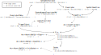

# Coding

## Building the guide

```bash
cargo install mdbook
(cd mdbook && mdbook build)
firefox build/guide/index.html
```

## Building the rust docs

```bash
(cd src && cargo doc --workspace --exclude shadow-tests)
```

## Generating compiler command database

Many tools benefit from a [compiler command
database](https://clangd.llvm.org/design/compile-commands), conventionally in a
file called `compile_commands.json`. If shadow's `setup` script finds the
[bear](https://github.com/rizsotto/Bear) tool on your `PATH`, it will
automatically use it to create and update `build/compile_commands.json` when
running `setup build`.

## Files and descriptors



Shadow currently has two ways of simulating descriptors. The first is
[`LegacyDescriptor`][legacy-descriptor] which is written in C and is used for
most descriptor/file types (IP sockets, epoll, files, etc). With this type, the
epoll file / posix description and its descriptor live in the same object. The
second way of simulating descriptors is in Rust, where we have a [`File`][file]
type that can be referenced by many [`Descriptor`][descriptor] objects.  This
allows us to easily implement [`dup()`][dup] for descriptors implemented with
this new code. Our plan is to move existing legacy descriptors over to these
new Rust file types.

[legacy-descriptor]: https://github.com/shadow/shadow/blob/ff671ffdf038597334ae467c56fe774c40b7864a/src/main/host/descriptor/descriptor_types.h#L48-L60
[file]: https://shadow.github.io/docs/rust/shadow_rs/host/descriptor/enum.File.html
[descriptor]: https://shadow.github.io/docs/rust/shadow_rs/host/descriptor/struct.Descriptor.html
[dup]: https://shadow.github.io/docs/rust/shadow_rs/host/descriptor/struct.Descriptor.html#method.dup

## Platform (libc and Linux) crates

We use several Rust crates for accessing platform functionality and definitions.
Roughly from lowest-level to highest-level:

* Our [`linux-api`](https://github.com/shadow/shadow/tree/main/src/lib/linux-api)
crate provides fairly low-level bindings over the Linux kernel headers, and a
few `nix`-style higher-level wrappers. It does not depend on `std` or `libc`.
It also re-exports these definitions as a C library that can be used without
creating conflicts with libc headers or linux system headers.
Use this when working with the syscall ABI (such as when implementing syscall
handlers), and for making syscalls when none of the higher-level crates are
suitable (see below).

* [`libc`](https://docs.rs/libc/latest/libc/) provides fairly low-level bindings
of system libc standard headers. If you need syscall-level ABI-compatibility,
use `linux-api` instead. If you don't, prefer one of the higher-level crates.

* [`nix`](https://docs.rs/nix/latest/nix/) provides a safer and more Rust-idiomatic
layer on top of the `libc` crate, as well as adapters for underlying `libc` definitions.
There's currently a lot of usage of this in Shadow, but we're trying to move away from it.
In most scenarios, one of the other crates mentioned here is a more appropriate choice.

* [`rustix`](https://docs.rs/rustix/latest/rustix/) provides a similar API to `nix`, but
can be configured not to depend on `std` or `libc`. This is useful in code that's linked
into Shadow's shim, where we don't want to depend on `std` or `libc`.

* Rust's [`std`](https://doc.rust-lang.org/std/) crate provides, well, the standard
way of interacting with the platform, in a portable and Rust-idiomatic way. This is
generally the right choice for code that *doesn't* run in Shadow's shim, in places
we're not concerned about the precise syscalls that get executed.

When choosing which one to use:

*   For code that will be linked into shadow's
    [shim](https://github.com/shadow/shadow/tree/main/src/lib/shim), prefer
    `rustix`. In cases where `rustix` doesn't provide the desired
    functionality, or in C code, or when we need precise control over what
    syscall is made with what parameters, use `linux-api`.

    We want to minimize, and ideally eliminate, usage of `libc` from the shim. `libc` has
    global state that can easily become corrupted when we use it from the shim,
    which is `LD_PRELOAD`ed into managed programs. This is especially because
    much of the shim executes in the context of `SIGSYS` signal handlers, meaning we might already
    be in a non-reentrant, non-[async-signal-safe](https://man7.org/linux/man-pages/man7/signal-safety.7.html) libc function higher in the stack. See also <https://github.com/shadow/shadow/milestone/54>. 

*   For shadow's syscall handler implementations, prefer `linux-api`.

    Since we are intercepting and implementing at the syscall level, the interface
    we are implementing is the Linux syscall ABI interface. Therefore we should
    be careful to use Linux's definitions for the parameters and return values.
    While types and constants in libc are *often* equivalent to kernel types and
    constants with the same names, there are many known cases where they
    aren't, and in general there's no guarantee even that one that is consistent
    today will remain consistent tomorrow. See also
    <https://github.com/shadow/shadow/issues/3007>.

    This also applies when implementing a syscall by delegating to the host
    system.  For example suppose we implement a `fcntl` syscall by by making a
    native `fcntl` syscall on the native file descriptor. Making the syscall
    directly is the most straightforward way to "pass through" exactly the
    original intended semantics. If we use a higher level interface, even
    `libc`, we have to be careful about translating the parameters and return
    values back and forth between the two different API layers.

*   For code that runs in the shadow process, where we are acting as a "normal" program
    that wants to interact with the kernel, generally prefer the highest-level
    interface that provides the necessary functionality. e.g. when creating worker
    threads in Rust, we generally use `std::thread`; there's no reason to use one of the lower
    level crates. Occasionally we need some functionality not provided in `std` though, in which case it makes sense to drop down to one of the lower level crates.

*   In tests, any of the above can make sense. In places we're specifically trying
    to test shadow's emulation of some functionality, making direct syscalls,
    e.g. with the `linux-api` crate or `libc`'s `syscall` function, is the most
    direct and precise approach. On the other hand, we often want to test higher
    level interfaces as a form of integration testing, since those are more
    typically what managed programs use.  We usually focus on testing at the
    `libc` interface, since most managed programs use that interface, and it's
    low-level enough to be able to control and understand what's happening at
    the syscall level. For incidental system functionality in tests (e.g.
    creating a temp file, in a test that isn't specifically trying to test that
    functionality) it usually makes sense to use whatever interface is most
    idiomatic and convenient.