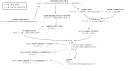

# Coding

## Building the C-Rust bindings

Shadow contains both C and Rust code, and we automatically generate bindings
for both languages so that they can interoperate. Changing function or type
definitions may require you to rebuild the bindings. This can be done using
the `--bindings` option to the `setup` script's `build` command:

```bash
./setup build --bindings
```

## Building the guide

```bash
cargo install mdbook
(cd mdbook && mdbook build)
firefox build/guide/index.html
```

## Files and descriptors



Shadow currently has two ways of simulating descriptors. The first is
[`LegacyDescriptor`][legacy-descriptor] which is written in C and is used for
most descriptor/file types (IP sockets, epoll, files, etc). With this type, the
epoll file / posix description and its descriptor live in the same object. The
second way of simulating descriptors is in Rust, where we have a [`File`][file]
type that can be referenced by many [`Descriptor`][descriptor] objects.  This
allows us to easily implement [`dup()`][dup] for descriptors implemented with
this new code. Our plan is to move existing legacy descriptors over to these
new Rust file types.

[legacy-descriptor]: https://github.com/shadow/shadow/blob/ff671ffdf038597334ae467c56fe774c40b7864a/src/main/host/descriptor/descriptor_types.h#L48-L60
[file]: https://shadow.github.io/docs/rust/shadow_rs/host/descriptor/enum.File.html
[descriptor]: https://shadow.github.io/docs/rust/shadow_rs/host/descriptor/struct.Descriptor.html
[dup]: https://shadow.github.io/docs/rust/shadow_rs/host/descriptor/struct.Descriptor.html#method.dup
